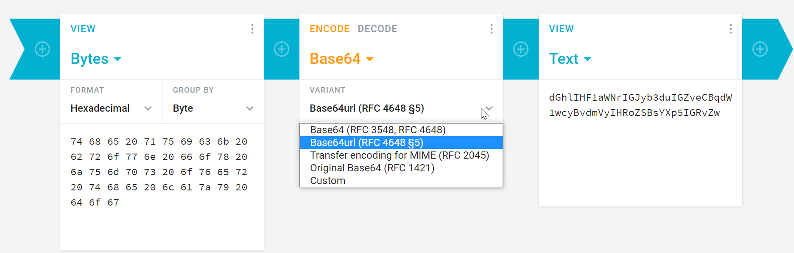

# JWS-Signature-Utility

### Command to convert RSAkey to private key with command 
`openssl pkcs8 -topk8 -inform PEM -in client.key -out bpx-client-private-key.pem -nocrypt`

### Used depandency 

		    <dependency>
    			<groupId>com.google.code.gson</groupId>
    			<artifactId>gson</artifactId>
    		</dependency>
    		<dependency>
    			<groupId>com.nimbusds</groupId>
    			<artifactId>nimbus-jose-jwt</artifactId>
    			<version>8.22.1</version>
    		</dependency>
    		<dependency>
        		<groupId>commons-io</groupId>
        		<artifactId>commons-io</artifactId>
        		<version>2.6</version>
    		</dependency>
    		<dependency>
        		<groupId>commons-codec</groupId>
        		<artifactId>commons-codec</artifactId>
    		</dependency>

### For kid
For this you need **signing certificate**

***Command :*** `openssl x509 -in <Signing-pem>.pem -noout -text`
 after this command you will get the value like:

     D5:21:B9:E3:05:A8:36:A5:5B:D4:7D:B1:88:1B:23:38:ED:3D:A6:D7

 Copy the value of *X503v Subject Key Identifier* and replace the colon with whitespace-  `D5 21 B9 E3 05 A8 36 A5 5B D4 7D B1 88 1B 23 38 ED 3D A6 D7`

### For converting this subject key indentifier  into Base64 use below URL

URL : [https://cryptii.com/pipes/hex-to-base64](https://cryptii.com/pipes/hex-to-base64 "https://cryptii.com/pipes/hex-to-base64")

For  out code the second is worked but select as per your requirement 

